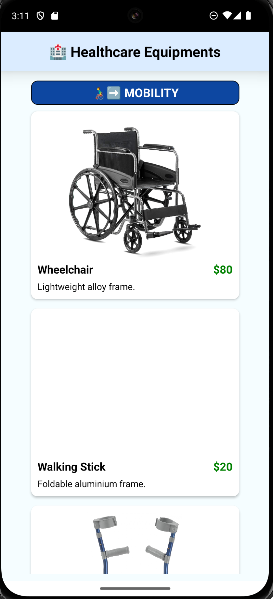
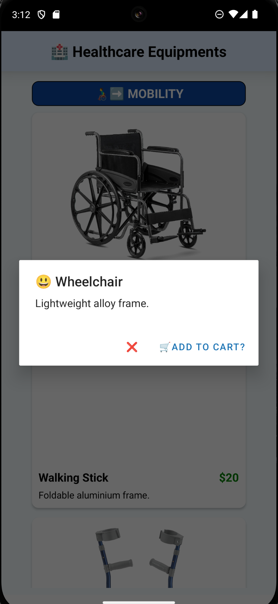

# 🌙 C346 Week05 Lesson10 Exercise 4 (Healthcare Equipments Catalogue)

[](#)
[](#)
[](#)
[](#)

---

## 📝 Overview

Lessons 9 & 10 taught us on FlatLists and SectionLists, both of which acceepts data in the form of an array and a renderer function which helps render each element in the array. SectionList however have additional parameters that can be passed such as renderSectionHeader.

> ✨ _Example:_ Implemented FlatLists and SectionLists to display data in React Native.

---

## 🎬 Demo / Media

<p align="center">
  
</p>
<p align="center">
  
  
</p>

---

## 🚀 Features

- ✅ FlatLists
- ✅ SectionLists

---

## 💡 Key Concepts

| Concept         | Description                                                                           |
| :-------------- | :------------------------------------------------------------------------------------ |
| **FlatList**    | Helps with long scrolling list of similarly structured data.                          |
| **SectionList** | This is used if a list of items needs to be split and displayed in multiple sections. |

---

## 🧱 Code Snippet

```jsx
<View style={styles.container}>
  <View style={styles.mainHeaderContainer}>
    <Text style={styles.mainHeader}>🏥 Healthcare Equipments</Text>
  </View>
  <SectionList
    sections={medicalEquipmentData}
    renderItem={renderItem}
    renderSectionHeader={renderSectionHeader}
    contentContainerStyle={{
      paddingHorizontal: 10,
      paddingBottom: 50,
    }}
  />
  <StatusBar barStyle="default" />
</View>
```
